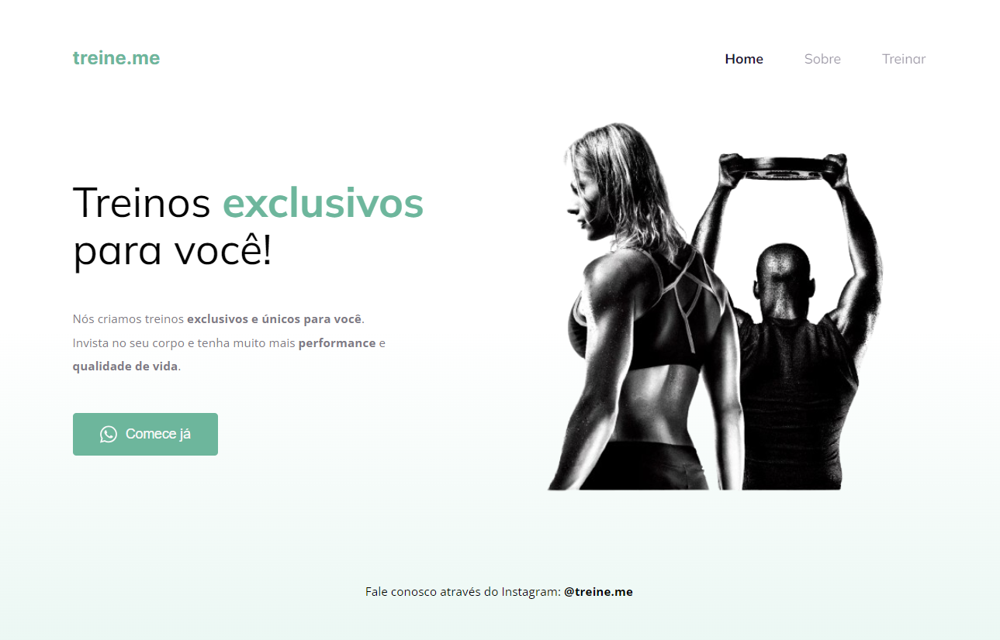

  

Este projeto trata-se de um sistema de treinos customizados desenvolvido com o objetivo de aprimorar ainda mais minhas habilidades CSS, focando na responsividade do site, estado de hover e gradiente.
 
## Tecnologias Utilizadas:

- [HTML](https://developer.mozilla.org/pt-BR/docs/Web/HTML)
- [CSS](https://developer.mozilla.org/pt-BR/docs/Web/CSS)

## Link para o site:

- [Página]https://atiliom0reira.github.io/treine.me/
